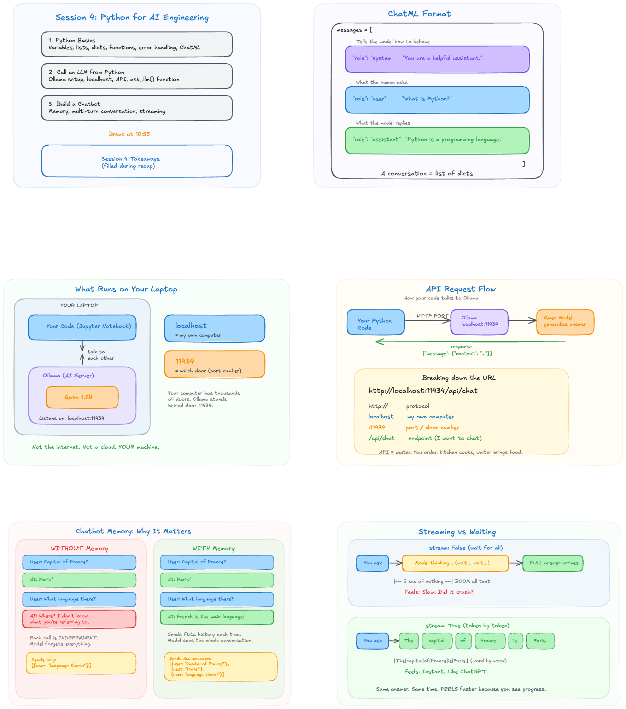

# Session 4 - Python for AI Engineering

**Date:** Sunday, 22 Jun 2026
**Module:** 2.1 - Python for AI (Part 1)
**Mentor:** Darsi Gangothri
**Whiteboard:** [session-4-canvas.png](./session-4-canvas.png)

---

## What We Covered

### 1. Python Basics

**Variables and data types:**

```python
name = "Gangothri"      # string (text)
age = 28                # integer (whole number)
height = 5.6            # float (decimal)
is_mentor = True        # boolean (True/False)
```

**f-strings (formatted strings):**

```python
greeting = f"Hi, my name is {name} and I am {age} years old."
print(greeting)
```

**Lists (ordered collection):**

```python
fruits = ["apple", "banana", "mango"]
print(fruits[0])       # "apple" (index starts at 0)
fruits.append("grape") # add to the end
print(len(fruits))     # 4
```

**Dictionaries (key-value pairs):**

```python
person = {
    "name": "Rahul",
    "age": 25,
    "city": "Bangalore"
}
print(person["name"])  # "Rahul"
person["email"] = "rahul@gmail.com"  # add new key
```

**Functions:**

```python
def greet(name):
    return f"Hello, {name}! Welcome to the class."

print(greet("Priya"))
```

**Error handling (try/except):**

```python
numbers = [1, 2, 3]
try:
    print(numbers[10])  # will crash
except IndexError as e:
    print(f"Error: {e}")

print("Code keeps running!")  # this still executes
```

---

### 2. ChatML Format

Every AI conversation is stored as a list of dictionaries. This is how ALL LLM APIs work:

```python
messages = [
    {"role": "system", "content": "You are a helpful assistant."},
    {"role": "user", "content": "What is Python?"},
    {"role": "assistant", "content": "Python is a programming language."}
]
```

Three roles:
- **system** --- tells the model how to behave (personality, rules)
- **user** --- what the human asks
- **assistant** --- what the model replies

---

### 3. Ollama - Running AI Locally

**What is Ollama?**
A program that runs AI models on your own laptop. It acts as a local server.

**Key concepts:**
- `localhost` = your own computer (not the internet)
- `11434` = port number (like a door Ollama listens behind)
- `http://localhost:11434` = "talk to Ollama on my machine, door 11434"

**Useful commands:**
```
ollama --version        # check if installed
ollama list             # see downloaded models
ollama serve            # start server if not running
```

---

### 4. Calling an LLM from Python

```python
import requests
import json

def ask_llm(prompt):
    response = requests.post(
        "http://localhost:11434/api/chat",
        json={
            "model": "qwen3:1.7b",
            "messages": [
                {"role": "system", "content": "You are a helpful assistant."},
                {"role": "user", "content": prompt}
            ],
            "stream": False
        }
    )
    result = response.json()["message"]["content"]
    if "<think>" in result:
        result = result.split("</think>")[-1].strip()
    return result
```

**URL breakdown:**
- `http://` --- protocol
- `localhost` --- my computer
- `:11434` --- port/door number
- `/api/chat` --- endpoint ("I want to chat")

**Testing it:**
```python
answer = ask_llm("What is Python in one sentence?")
print(answer)
```

---

### 5. Chatbot with Memory

**The problem:** Each LLM call is independent. The model forgets everything between calls.

**The fix:** Send the ENTIRE conversation history with every call.

```python
def chat():
    messages = [
        {"role": "system", "content": "You are a friendly AI assistant. Keep responses to 2-3 sentences."}
    ]
    print("Chatbot ready! Type 'quit' to exit.\n")

    while True:
        user_input = input("You: ")
        if user_input.lower() == "quit":
            print("Goodbye!")
            break

        messages.append({"role": "user", "content": user_input})

        response = requests.post(
            "http://localhost:11434/api/chat",
            json={
                "model": "qwen3:1.7b",
                "messages": messages,
                "stream": False
            }
        )

        assistant_message = response.json()["message"]["content"]
        if "<think>" in assistant_message:
            assistant_message = assistant_message.split("</think>")[-1].strip()

        messages.append({"role": "assistant", "content": assistant_message})
        print(f"AI: {assistant_message}\n")
```

**How memory works:**
- Each user message gets appended to the `messages` list
- Each AI response also gets appended
- Every API call sends the full growing list
- The model reads ALL of it and responds in context

This is how ChatGPT, Claude, and every chatbot works.

---

## Key Takeaways

1. Python basics: variables, lists, dicts, functions, error handling
2. ChatML format: conversations are lists of dicts with role and content
3. Ollama runs AI locally: localhost:11434
4. One function (`ask_llm`) bridges Python and AI
5. Chatbots work by sending full conversation history every call

---

## Homework

**1. Python basics practice:**
- Go through variables, lists, dicts, functions, try/except on your own
- Write small examples, experiment
- Make sure you are comfortable with these before next class

**2. Get the chatbot running:**
- Copy the code from this session, run it on your machine
- If Ollama crashes, restart it (`ollama serve` in a fresh terminal)
- Try changing the system prompt (pirate, fitness coach, professor)

---

## Whiteboard



---

## Next Session

**Session 5:** Streaming (how ChatGPT shows text word by word), Pydantic (structured outputs), and going inside the model --- neural networks and Transformers.
