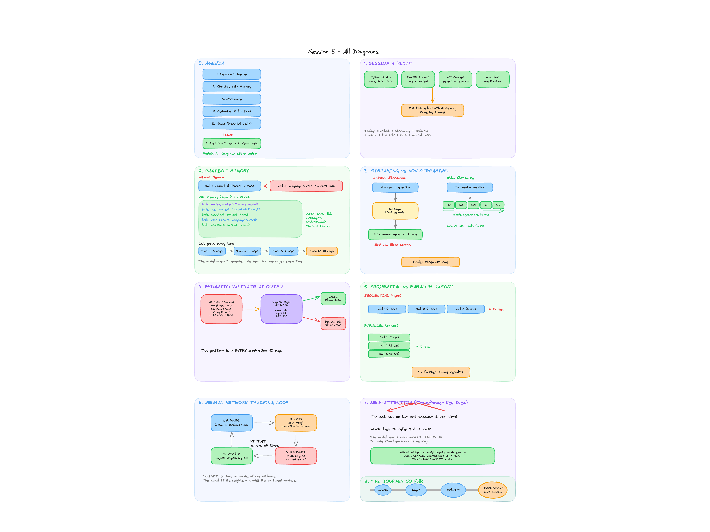

# Session 5 - Chatbot, Streaming, Pydantic, Async + Neural Networks

**Module:** 2.1 (Part 2) + 2.2 Intro  
**Duration:** 2 hours  
**Mentor:** Darsi Gangothri

## What We Covered

- Chatbot with memory (multi-turn conversation using full message history)
- Streaming (word-by-word AI responses)
- Pydantic (validating AI outputs for production safety)
- Async/Await (parallel AI calls, 3x faster)
- File I/O + JSON (reading/writing configs, logs)
- Virtual environments (isolated Python project packages)
- Neural network intuition (neurons, layers, training loop)
- Transformer teaser (self-attention mechanism)

## Files

| File | Description |
|------|-------------|
| [session-5-teaching-notes.md](./session-5-teaching-notes.md) | Full teaching notes with explanations for each topic |
| [session-5-notebook.ipynb](./session-5-notebook.ipynb) | Notebook (uses Ollama for local AI) |
| [session-5-handout.pdf](./session-5-handout.pdf) | PDF handout (notes + whiteboard + code) |

## Whiteboard

## Setup (for learners)

1. Install Ollama: https://ollama.com
2. Pull a model: `ollama pull llama3.2`
3. Start Ollama: `ollama serve`
4. Open the notebook in Google Colab or locally with Jupyter

## Homework

1. Streaming Chatbot - Add streaming to the chatbot. Change the system prompt to a creative personality.
2. Pydantic Validation - Define a model (Movie/Recipe/Book). Ask AI to generate data. Validate it.
3. (Optional) Create a virtual environment. Install `ollama` and `pydantic`. Run a script.

## Next Session (Session 6)

Transformer deep dive: self-attention mechanics, multi-head attention, tokenizers, embeddings, HuggingFace Transformers library.
