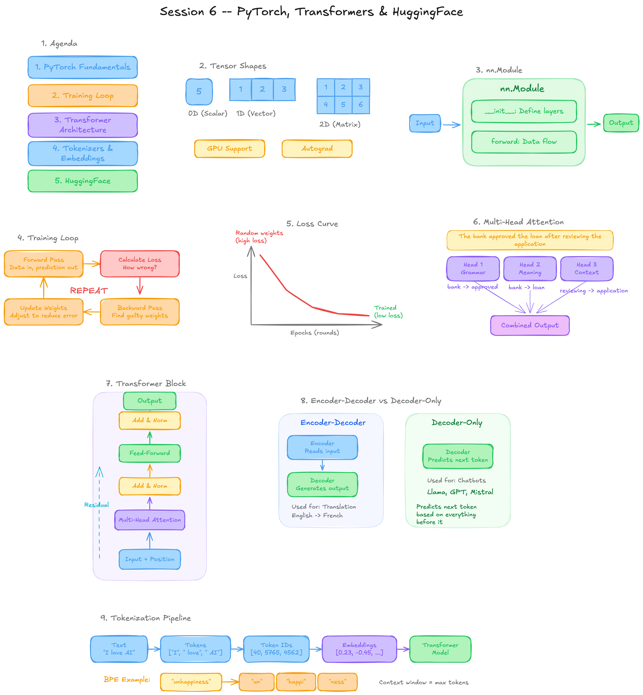

# Session 6 - PyTorch & Transformers

**Module:** 2.2 (Part 1)  
**Duration:** 2 hours  
**Mentor:** Darsi Gangothri

## What We Covered

- PyTorch fundamentals (tensors, tensor operations, GPU + autograd superpowers)
- nn.Module (building neural networks: `__init__` + `forward`)
- Training loop in code (y=2x problem, 500 epochs, loss convergence)
- Full Transformer architecture (multi-head attention, positional encoding, decoder-only)

## Files

| File | Description |
|------|-------------|
| [session-6-teaching-notes.md](./session-6-teaching-notes.md) | Full teaching notes with explanations for each topic |
| [session-6-notebook.ipynb](./session-6-notebook.ipynb) | Notebook with all code from the session |
| [session-6-handout.pdf](./session-6-handout.pdf) | PDF handout (notes + whiteboard + code) |

## Whiteboard

## Setup (for learners)

1. Google Colab works out of the box (PyTorch is pre-installed)
2. For local: `pip install torch`
3. Open the notebook and run cells in order

## Homework

1. Run the training loop notebook. Change the learning rate to 0.1 and to 0.001. What happens to the loss? Compare.

## Next Session (Session 7)

Tokenizers and embeddings (how text becomes numbers), HuggingFace Transformers library (load any model in 3 lines), open-source LLM landscape, quantization, and Ollama deep dive.
